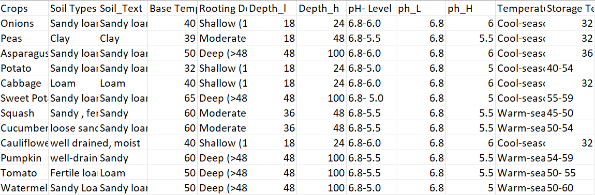

```{r, include = FALSE}
knitr::opts_chunk$set(
  collapse = TRUE,
  comment = "#>"
)
```
```{r setup, include=FALSE}
knitr::opts_chunk$set(echo = TRUE, eval = FALSE)
```
Downloading Libraries to Load, Clean and Format Data
```{r, eval=FALSE}
library(dplyr)
library(tidyr)
library(tidyverse)
library(tidycensus)
library(dplyr)
library(ggplot2)
```


# Step One: Pulling Data

### Loading Weather Data
For the purpose of calculations of the Growing Degree Days, data about the average temperature of days is required. For this reason, the first task is to load the data. It was retrieved from [**Iowa Mesonet Reanalysis Tool (IEMRE)**](https://mesonet.agron.iastate.edu/iemre/)

```{r model-function, eval=FALSE}
mydata <- read.csv("2015_2021_clim.csv")
View(mydata)
```

### Loaded the specialty crop dataset as a csv 
Information about the Specialty Crops, and their Base Temperature is required to measue the GDD. Thus the dataset is loaded as a csv. 
The information and data used to create the specialty crop dataset is collected from the *2022-Midwest-Veg-Guide* and the *Donald N. Maynard, George J. Hochmuth -Knott's Handbook forVegetable Growers-Wiley*.

### Snippet of the dataset
```{r}

```

```{r model-function1, eval=FALSE}
newdata <- read.csv("Crop-Info_Farmer Asset Mapping.csv")
View(newdata)
```

# Step Two: Cleaning the Data
Dropped certain columns that didn't have information required for the GDD calculations. Additionally removed rows with no/null data, for easy and clear visualization

```{r model-function2, eval=FALSE}
new_data <- newdata[-c(20:38), ] 
View(new_data)
  
mydata = subset(mydata, select = -c(`mrms_precip_in`,`prism_precip_in`,`X12z_high_f`,`climate_daily_high_f`,`X12z_low_f`,`climate_daily_low_f`,`daily_precip_in`,`X12z_precip_in`,`climate_daily_precip_in` ) )
```
# Step Three: Calculations

Calculated the average temperatures of every day from 2015-2021.This was done by adding the *lowest Temperature of that day* to the *Highest Temperature of that day*, and then diving the sum by 2.

```{r model-function3, eval=FALSE}
mydata$Average_temp = (mydata$daily_high_f + mydata$daily_low_f)/2

View(mydata)
```

### Calculating the Growing Degree Days 
- The calculations are made by subtracting the Base Temperatures of the crops from the Mean Temperature of the Day. 
- This helped to get the GDD for all the specialty crops, from 2015-2021.

```{r model-function4, eval=FALSE}
mydata$OnionGDD <- mydata$Average_temp - 40

mydata$PeasGDD <- mydata$Average_temp - 39

mydata$AsparagusGDD <- mydata$Average_temp - 50

mydata$PotatoGDD <- mydata$Average_temp - 32

mydata$CabbageGDD <- mydata$Average_temp - 40

mydata$Sweet_PotatoGDD <- mydata$Average_temp - 65

mydata$SquashGDD <- mydata$Average_temp - 60

mydata$CucumberGDD <- mydata$Average_temp - 60

mydata$CauliflowerGDD <- mydata$Average_temp - 40

mydata$PumpkinGDD <- mydata$Average_temp - 60

mydata$TomatoGDD <- mydata$Average_temp - 50

mydata$WatermelonGDD <- mydata$Average_temp - 50

mydata$CarrotGDD <- mydata$Average_temp - 40

mydata$Sweet_cornGDD <- mydata$Average_temp - 50

mydata$LettuceGDD <- mydata$Average_temp - 40

mydata$EggplantGDD <- mydata$Average_temp - 50

mydata$RadishGDD <- mydata$Average_temp - 40

mydata$SpinachGDD <- mydata$Average_temp - 35

mydata$CantaloupeGDD <- mydata$Average_temp - 65

View(mydata)
``` 
If Average Temperature of the day is lesser than the Base Temperature, then the GDD = 0. 
The code helps to search GDD values that have negative value, and replace those values with 0

```{r model-function5, eval=FALSE}
mydata$OnionGDD= ifelse(mydata$OnionGDD < 0, "0", mydata$OnionGDD)
mydata$PeasGDD= ifelse(mydata$PeasGDD < 0, "0",mydata$PeasGDD )
mydata$AsparagusGDD= ifelse(mydata$AsparagusGDD < 0, "0", mydata$AsparagusGDD )
mydata$PotatoGDD= ifelse(mydata$PotatoGDD < 0, "0", mydata$PotatoGDD )
mydata$CabbageGDD= ifelse(mydata$CabbageGDD < 0, "0",mydata$CabbageGDD )
mydata$Sweet_PotatoGDD= ifelse(mydata$Sweet_PotatoGDD < 0, "0",mydata$Sweet_PotatoGDD )
mydata$SquashGDD= ifelse(mydata$SquashGDD < 0, "0",mydata$SquashGDD )
mydata$CucumberGDD= ifelse( mydata$CucumberGDD< 0, "0",mydata$CucumberGDD )
mydata$CauliflowerGDD= ifelse(mydata$CauliflowerGDD < 0, "0", mydata$CauliflowerGDD)
mydata$PumpkinGDD= ifelse(mydata$PumpkinGDD < 0, "0",mydata$PumpkinGDD )
mydata$TomatoGDD= ifelse( mydata$TomatoGDD< 0, "0",mydata$TomatoGDD )
mydata$WatermelonGDD= ifelse(mydata$WatermelonGDD < 0, "0",mydata$WatermelonGDD )
mydata$CarrotGDD= ifelse( mydata$CarrotGDD< 0, "0",mydata$CarrotGDD )
mydata$Sweet_cornGDD= ifelse(mydata$Sweet_cornGDD < 0, "0",mydata$Sweet_cornGDD )
mydata$LettuceGDD= ifelse(mydata$LettuceGDD < 0, "0",mydata$LettuceGDD )
mydata$EggplantGDD= ifelse(mydata$EggplantGDD < 0, "0",mydata$EggplantGDD )
mydata$RadishGDD= ifelse(mydata$RadishGDD < 0, "0",mydata$RadishGDD )
mydata$SpinachGDD= ifelse(mydata$SpinachGDD < 0, "0",mydata$SpinachGDD )
mydata$CantaloupeGDD= ifelse(mydata$CantaloupeGDD < 0, "0",mydata$CantaloupeGDD )

View(mydata)
glimpse(mydata)
```
# Step Four: Formatting

Separating the Months and Years, in order to group data by the Year
```{r, eval=FALSE}
mydata2 <- mydata %>% mutate(Month = substr(date,0,1), year= substr(date, (nchar(date)-3), nchar(date))) %>% mutate(Month = ifelse(Month ==1,10,Month))%>% group_by(year, Month) %>% summarise(acc_gdd_onion= sum(as.numeric(OnionGDD)),acc_gdd_peas = sum(as.numeric(PeasGDD)), acc_gdd_asparaguss = sum(as.numeric(AsparagusGDD)), acc_gdd_potato = sum(as.numeric(PotatoGDD)), acc_gdd_cabbage = sum(as.numeric(CabbageGDD)), acc_gdd_sweet_potato = sum(as.numeric(Sweet_PotatoGDD)), acc_gdd_Squash = sum(as.numeric(SquashGDD)), acc_gdd_cucumber = sum(as.numeric(CucumberGDD)), acc_gdd_Cauliflower = sum(as.numeric(CauliflowerGDD)), acc_gdd_Pumpkin = sum(as.numeric(PumpkinGDD)), acc_gdd_Tomato = sum(as.numeric(TomatoGDD)), acc_gdd_Watermelon = sum(as.numeric(WatermelonGDD)), acc_gdd_carrot = sum(as.numeric(CarrotGDD)), acc_gdd_sweet_corn = sum(as.numeric(Sweet_cornGDD)), acc_gdd_lettuce = sum(as.numeric(LettuceGDD)), acc_gdd_Eggplant = sum(as.numeric(EggplantGDD)), acc_gdd_radish = sum(as.numeric(RadishGDD)), acc_gdd_spinach = sum(as.numeric(SpinachGDD)), acc_gdd_cantaloupe = sum(as.numeric(CantaloupeGDD)))
```

Specifying the target months, and formatting the dates clearly. 
The target months include April, May, June, July, August, September and October. Other months have lower average temperatures, thus not possible to grow crops then.

```{r, eval=FALSE}
mydata2<- mydata2 %>%
  mutate(Date = paste(Month,year,sep="/"))
 
mydata2$Month = ifelse(mydata2$Month == 4,"April",
                       ifelse(mydata2$Month == 5, "May",
                              ifelse(mydata2$Month == 6, "June",
                                     ifelse(mydata2$Month == 7, "July",
                                            ifelse(mydata2$Month == 8, "August",
                                                   ifelse(mydata2$Month == 9, "September",
                                                          ifelse(mydata2$Month == 10,"October", mydata2$Month))))))) 

                                                                                                                                                                                                                                                                                               
View(mydata2)
```  
Saving the data as a csv file to the local directory

```{r, eval=FALSE}
write.csv(mydata2, "S:/DSPG2022/ProjectB/Speciality_Crops_GDD_cleaned_2015-2021.csv", row.names = FALSE)
```
